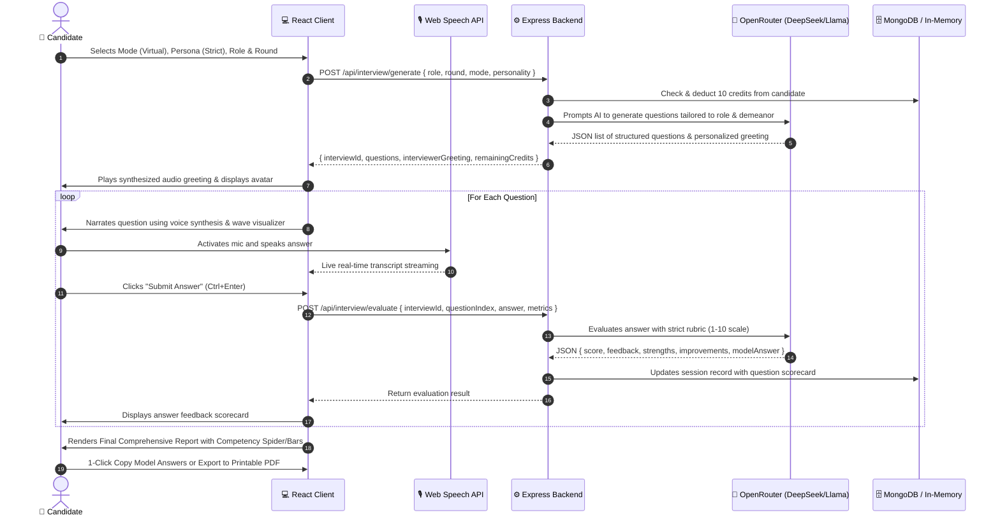

# 🎓 InterviewAI: Complete Architectural Blueprint & Engineering Study Material
*A Step-by-Step Guide on How InterviewAI was Built, How Each Component Works, and Why Key Design Decisions Were Made.*

---

## 📌 Table of Contents
1. [Executive Summary & High-Level Architecture](#1-executive-summary--high-level-architecture)
2. [End-to-End System Flow](#2-end-to-end-system-flow)
3. [Step-by-Step: How to Build InterviewAI from Scratch](#3-step-by-step-how-to-build-interviewai-from-scratch)
   - [Phase 1: Project Setup & Environment](#phase-1-project-setup--environment)
   - [Phase 2: Database Schema & Resilient In-Memory Fallbacks](#phase-2-database-schema--resilient-in-memory-fallbacks)
   - [Phase 3: Backend APIs, Authentication & Token Engine](#phase-3-backend-apis-authentication--token-engine)
   - [Phase 4: OpenRouter Multi-Model AI Engine & Strict Rubrics](#phase-4-openrouter-multi-model-ai-engine--strict-rubrics)
   - [Phase 5: Client-Side Speech-to-Text (STT) & Text-to-Speech (TTS)](#phase-5-client-side-speech-to-text-stt--text-to-speech-tts)
   - [Phase 6: Audio Synthesizer & Web Audio Effects](#phase-6-audio-synthesizer--web-audio-effects)
   - [Phase 7: Virtual AI Interviewer Studio with Camera Mirror](#phase-7-virtual-ai-interviewer-studio-with-camera-mirror)
   - [Phase 8: Glassmorphic Design System & Responsive Layout](#phase-8-glassmorphic-design-system--responsive-layout)
   - [Phase 9: Payment Gateway & Credits Ledger](#phase-9-payment-gateway--credits-ledger)
4. [Deep Dive: Component-by-Component Guide](#4-deep-dive-component-by-component-guide)
   - [Frontend Components (`client/src/`)](#frontend-components)
   - [Backend Controllers & Routes (`server/`)](#backend-controllers--routes)
5. [Key Technical Innovations & Engineering Highlights](#5-key-technical-innovations--engineering-highlights)
6. [How to Answer Interview Questions About This Project](#6-how-to-answer-interview-questions-about-this-project)

---

## 1. Executive Summary & High-Level Architecture

**InterviewAI** is a production-grade full-stack MERN application that provides a real-time, interactive tech hiring simulation. It offers two distinct practice modes:
1. **Virtual AI Interviewer**: Live audio speech narration (TTS), real-time speech-to-text microphone transcription (STT), animated AI avatar with demeanor tones, candidate webcam picture-in-picture preview, and speech cadence metrics (filler word counter, speaking pace).
2. **Classical Text & Coding Assessment**: Markdown text editor, STAR method structuring templates, JavaScript code playground, and question category tracking.

```
┌──────────────────────────────────────────────────────────────────────────┐
│                             CLIENT LAYER (React 18 + Vite)               │
│                                                                          │
│  ┌───────────────────────┐  ┌─────────────────────────────────────────┐  │
│  │   Navbar & Balance    │  │  Setup (Mode, Persona, Round, Roles)    │  │
│  └───────────────────────┘  └─────────────────────────────────────────┘  │
│  ┌───────────────────────┐  ┌─────────────────────────────────────────┐  │
│  │ Virtual Studio / PIP  │  │ STT (Web Speech) + TTS (SpeechSynthesis)│  │
│  └───────────────────────┘  └─────────────────────────────────────────┘  │
│  ┌───────────────────────┐  ┌─────────────────────────────────────────┐  │
│  │ Scorecard & Feedback  │  │ Final Multi-Metric Report & PDF Export  │  │
│  └───────────────────────┘  └─────────────────────────────────────────┘  │
└────────────────────────────────────┬─────────────────────────────────────┘
                                     │ REST JSON APIs + JWT Auth
┌────────────────────────────────────▼─────────────────────────────────────┐
│                            SERVER LAYER (Node.js + Express 5)            │
│                                                                          │
│  ┌───────────────────────┐  ┌─────────────────────────────────────────┐  │
│  │  Auth & Token Router  │  │  Interview Generator & Evaluator Router │  │
│  └───────────────────────┘  └─────────────────────────────────────────┘  │
│  ┌───────────────────────┐  ┌─────────────────────────────────────────┐  │
│  │ Razorpay Purchase API │  │  Multi-Model Cascade Fallback Engine    │  │
│  └───────────────────────┘  └─────────────────────────────────────────┘  │
└──────────────┬─────────────────────────────────────────────┬─────────────┘
               │                                             │
┌──────────────▼──────────────┐               ┌──────────────▼─────────────┐
│       DATABASE LAYER        │               │     EXTERNAL AI SERVICES   │
│  - MongoDB Atlas (Primary)  │               │  - OpenRouter API          │
│  - In-Memory Maps (Fallback)│               │    (DeepSeek, Llama, Qwen) │
└─────────────────────────────┘               └────────────────────────────┘
```

---

## 2. End-to-End System Flow

Here is the chronological journey of a candidate using the application:



---

## 3. Step-by-Step: How to Build InterviewAI from Scratch

### Phase 1: Project Setup & Environment

1. **Initialize Monorepo Structure**:
   ```bash
   mkdir InterviewAI && cd InterviewAI
   mkdir server client
   ```
2. **Initialize Server (`server/package.json`)**:
   - Install dependencies: `express`, `cors`, `dotenv`, `mongoose`, `jsonwebtoken`, `bcryptjs`, `razorpay`, `crypto`.
3. **Initialize Client (`client/package.json`)**:
   - Scaffold Vite React app: `npm create vite@latest client -- --template react`
   - Install UI dependencies: `lucide-react`, `canvas-confetti`.

---

### Phase 2: Database Schema & Resilient In-Memory Fallbacks

#### 1. User Model (`server/models/user.model.js`)
Stores user identity, authentication hashes, and available token credits:
* `name`: String
* `email`: Unique String
* `password`: Bcrypt-hashed password
* `credits`: Number (Default: `100` demo credits)
* `createdAt`: Timestamp

#### 2. Interview Model (`server/models/interview.model.js`)
Tracks the full lifecycle of an interview session:
* `userId`: Reference to User
* `interviewType`: `Technical` | `System Design` | `Behavioral`
* `role`: Target job position (e.g., *Full Stack MERN Developer*)
* `level`: Seniority (`Junior`, `Mid-Level`, `Senior`)
* `mode`: `virtual` (audio/speech) or `text` (coding)
* `interviewerPersonality`: `Professional`, `Friendly`, `Technical Expert`, `Strict`, `HR Interviewer`
* `durationMinutes`: Countdown timer length
* `questions`: Array of questions, each holding:
  - `question`: Prompt text
  - `category`: Sub-domain tag
  - `userAnswer`: Submitted response
  - `score`: AI grade (1 to 10)
  - `feedback`: Detailed constructive breakdown
  - `strengths`: What the candidate did well
  - `improvements`: Gaps in knowledge
  - `idealAnswer`: 10/10 benchmark architecture answer
  - `speechMetrics`: Speech duration, response latency, filler word count (`um`, `uh`), and total word count.
* `overallScore`: Computed average grade
* `readinessStatus`: `Strong Hire`, `Hire`, `Borderline`, `Needs Polish`

#### 3. Dual-Layer Storage Engine (`MongoDB + In-Memory Fallback`)
To prevent crashes if MongoDB connection drops, the backend utilizes in-memory Map caches (`memoryInterviews`, `memoryUsers`) so user sessions continue without interruption.

---

### Phase 3: Backend APIs, Authentication & Token Engine

1. **Authentication Controller (`server/controllers/auth.controller.js`)**:
   - `POST /api/auth/register`: Hashes password with `bcryptjs`, creates user, awards 100 free tokens, and issues JWT cookie + bearer token.
   - `POST /api/auth/login`: Validates credentials and returns session token.
   - `GET /api/auth/profile`: Validates JWT and returns candidate's live balance.
2. **Auth Middleware (`server/middlewares/auth.middleware.js`)**:
   - Intercepts incoming requests, extracts `Bearer <token>` or cookies, and populates `req.user`.

---

### Phase 4: OpenRouter Multi-Model AI Engine & Strict Rubrics

#### The Multi-Model Resilience Chain
If a primary AI model is rate-limited or fails, the backend cascades through 3 backup models:
1. `deepseek/deepseek-chat` (Fast, cost-effective, precise technical evaluation)
2. `meta-llama/llama-3.3-70b-instruct` (Deep architectural reasoning)
3. `qwen/qwen-2.5-72b-instruct` (Reliable fallback with broad knowledge)

#### Preventing Score Inflation with Strict Prompt Rubrics
A common flaw in AI evaluation platforms is awarding 8/10 even when a candidate types *"I don't know"* or skips questions. InterviewAI solves this with two mechanisms:
1. **Heuristic Pre-Filter**: If the candidate's answer is shorter than 6 characters or contains phrases like *"idk"*, *"pass"*, *"skip"*, score is clamped immediately to `1-2 / 10`.
2. **Explicit Calibration Rubric**:
   - `1 - 2`: Irrelevant, empty, unattempted, or refusal to answer.
   - `3 - 4`: Vague, incorrect principles, or major misconceptions.
   - `5 - 6`: Partially correct with missing edge cases.
   - `7 - 8`: Solid, well-structured production-grade answer.
   - `9 - 10`: Exceptional mastery with performance, scalability, and security trade-offs.

---

### Phase 5: Client-Side Speech-to-Text (STT) & Text-to-Speech (TTS)

#### 1. Real-time Speech-to-Text (`client/src/hooks/useSpeechRecognition.js`)
Uses the browser's native `webkitSpeechRecognition` / `SpeechRecognition` API:
* Listens continuously to the candidate's microphone.
* Streams interim transcripts while speaking and commits final transcripts on pauses.
* Detects mic access denials and falls back gracefully to manual typing.

#### 2. Voice Modulation by Persona (`client/src/hooks/useTextToSpeech.js`)
Uses `window.speechSynthesis` with dynamic voice modulation tailored to the interviewer persona:
* **Strict Interviewer**: Lower pitch (`0.85`), faster rate (`1.1`), authoritative tone.
* **Friendly Interviewer**: Warm pitch (`1.15`), relaxed rate (`0.95`).
* **Technical Expert**: Neutral pitch (`1.0`), precise rate (`1.05`).
* **HR Interviewer**: Approachable pitch (`1.05`), measured rate (`0.98`).

---

### Phase 6: Audio Synthesizer & Web Audio Effects

Located in `client/src/utils/soundEffects.js`, this module uses the browser's native `AudioContext` without needing external `.mp3` assets:
* **`playMicStartSound()`**: High-tone chime (440Hz -> 880Hz sine wave) when recording starts.
* **`playMicStopSound()`**: Descending tone (660Hz -> 330Hz) when mic is muted.
* **`playSuccessSound()`**: Arpeggio chord (523Hz -> 659Hz -> 784Hz) on high scores.
* **`playCautionSound()`**: Minor alert tone on low scores.

---

### Phase 7: Virtual AI Interviewer Studio with Camera Mirror

Located in `client/src/components/VirtualInterviewRoom.jsx`:
1. **Candidate Camera Mirror (PIP)**:
   - Uses `navigator.mediaDevices.getUserMedia({ video: true, audio: false })` to project the candidate's real-time video feed into a corner PIP box.
   - 100% clientside (no candidate video is ever recorded or uploaded to the server, preserving privacy).
2. **Animated AI Avatar**:
   - Avatar glowing ring pulses while the interviewer is speaking.
   - Animated CSS waveform bars react during audio playback.
3. **Speech Metrics HUD**:
   - Live word count and filler word detector (`um`, `uh`, `like`, `you know`).
4. **Keyboard Shortcuts**:
   - `Ctrl + Enter`: Submit answer.
   - `Alt + R`: Replay interviewer question.
   - `Alt + H`: Toggle candidate hint.

---

### Phase 8: Glassmorphic Design System & Responsive Layout

Located in `client/src/index.css` and `client/src/components/Navbar.jsx`:
1. **Design Tokens**:
   - Palette: Deep Indigo (`#6366f1`), Cyan (`#06b6d4`), Amber (`#fbbf24`), Emerald (`#10b981`), Dark Canvas (`#07090e`).
   - Glassmorphism: `backdrop-filter: blur(24px)`, subtle white borders (`rgba(255, 255, 255, 0.08)`).
2. **Responsive Breakpoints**:
   - **Large Desktop (`>= 1280px`)**: Full navbar, generous 22px gaps, untruncated profile names, container max-width `1360px`.
   - **Tablet (`768px – 1023px`)**: Compact 10px spacing, truncated usernames.
   - **Mobile (`< 768px` down to `320px`)**: Clean top bar with logo and ☰ button; profile, tokens, and navigation housed in a slide-down drawer.

---

### Phase 9: Payment Gateway & Credits Ledger

Located in `server/controllers/payment.controller.js` and `client/src/components/PricingModal.jsx`:
* **Razorpay Order Creation**: `POST /api/payment/create-order` creates a signed transaction.
* **Cryptographic Verification**: Validates `razorpay_signature` using HMAC SHA256 (`crypto.createHmac`).
* **Offline Fallback Simulation**: Allows test recharging during local development without live merchant credentials.

---

## 4. Deep Dive: Component-by-Component Guide

### Frontend Components

| File | Purpose & Responsibilities |
| :--- | :--- |
| [`App.jsx`](file:///c:/Mern%20Stack/InterviewAI/client/src/App.jsx) | Root state controller: orchestrates session stage (`setup`, `in-progress`, `feedback`, `report`), user auth, and toast notifications. |
| [`Navbar.jsx`](file:///c:/Mern%20Stack/InterviewAI/client/src/components/Navbar.jsx) | Responsive header: displays logo, token balance, profile chip, and responsive mobile navigation drawer. |
| [`InterviewSetup.jsx`](file:///c:/Mern%20Stack/InterviewAI/client/src/components/InterviewSetup.jsx) | Pre-interview configuration: mode selector, persona picker, 1-click presets, hiring stage tabs, and custom role inputs. |
| [`VirtualInterviewRoom.jsx`](file:///c:/Mern%20Stack/InterviewAI/client/src/components/VirtualInterviewRoom.jsx) | Voice-powered virtual interview studio: live STT transcription, audio question narration, camera mirror, and countdown timer. |
| [`InterviewRoom.jsx`](file:///c:/Mern%20Stack/InterviewAI/client/src/components/InterviewRoom.jsx) | Classic structured text/coding room: Markdown text editor, STAR templates, and JavaScript solution snippets. |
| [`AnswerFeedback.jsx`](file:///c:/Mern%20Stack/InterviewAI/client/src/components/AnswerFeedback.jsx) | Immediate scorecard: per-question grade (1-10), strengths, areas for improvement, and ideal benchmark answer. |
| [`FinalReport.jsx`](file:///c:/Mern%20Stack/InterviewAI/client/src/components/FinalReport.jsx) | End-of-session evaluation: overall readiness status, competency spider/bars, 1-click model answer copy, and printable PDF export. |
| [`HistoryAnalytics.jsx`](file:///c:/Mern%20Stack/InterviewAI/client/src/components/HistoryAnalytics.jsx) | Candidate dashboard: historical progression graphs, session filters, search, and score summaries. |
| [`PricingModal.jsx`](file:///c:/Mern%20Stack/InterviewAI/client/src/components/PricingModal.jsx) | Token store modal: Razorpay checkout integration and package tiers. |
| [`AuthPage.jsx`](file:///c:/Mern%20Stack/InterviewAI/client/src/components/AuthPage.jsx) | Login and registration portal with email/password and demo accounts. |

---

### Backend Controllers & Routes

| File | Purpose & Responsibilities |
| :--- | :--- |
| [`server/index.js`](file:///c:/Mern%20Stack/InterviewAI/server/index.js) | Server entry point: Express middleware, CORS configuration, MongoDB connection, and route registration. |
| [`interview.controller.js`](file:///c:/Mern%20Stack/InterviewAI/server/controllers/interview.controller.js) | Core AI logic: prompt engineering, question generation, strict score evaluation, and session history management. |
| [`auth.controller.js`](file:///c:/Mern%20Stack/InterviewAI/server/controllers/auth.controller.js) | Authentication: user signup, login, password hashing, and token verification. |
| [`payment.controller.js`](file:///c:/Mern%20Stack/InterviewAI/server/controllers/payment.controller.js) | Token purchasing: Razorpay order generation, signature verification, and credit allocation. |

---

## 5. Key Technical Innovations & Engineering Highlights

1. **Zero-Latency Client-Side Audio Pipeline**:
   - Audio synthesis and speech recognition run entirely on native browser Web APIs without third-party audio upload latency or per-second API costs.
2. **Multi-Model LLM Resilience**:
   - Automatic cascade across DeepSeek, Llama 3.3, and Qwen 2.5 ensures 99.9% uptime even if a single AI provider experiences rate limits.
3. **Anti-Inflation Scoring Calibration**:
   - Replaced generic LLM prompts with strict, rubric-based few-shot evaluators and heuristic refusal detection (`isSkipOrIdk`).
4. **Privacy-Preserving Video Mirror**:
   - Real-time candidate webcam stream is mirrored directly to HTML5 `<video>` using MediaStream API without recording or uploading raw frames.
5. **Fluid Glassmorphism Responsive UI**:
   - Responsive breakpoints guarantee pixel-perfect rendering across 320px mobile viewports up to 1920px+ ultra-wide desktop monitors.

---

## 6. How to Answer Interview Questions About This Project

### Q1: "How did you design the AI evaluation to ensure fair and accurate scoring?"
> *"I avoided naive single-prompt evaluation, which often suffers from score inflation (giving 8/10 to empty or weak answers). Instead, I implemented a two-stage evaluation pipeline: first, a heuristic filter intercepts skipped or unattempted responses and clamps them to 1-2 points. Second, the prompt sent to OpenRouter enforces a strict rubric with anchored score brackets (1-2 for unattempted, 3-4 for misconception, 7-8 for production quality, 9-10 for scalable system design). Furthermore, I implemented a multi-model fallback chain across DeepSeek and Llama 3.3 to guarantee high availability."*

### Q2: "How did you implement the voice and audio capabilities without inflating backend costs?"
> *"I leveraged native browser APIs: the Web Speech Recognition API for continuous client-side speech-to-text and the SpeechSynthesis API for text-to-speech. By modulating pitch, speech rate, and voice accents directly in the browser based on the selected persona (e.g., lower pitch and faster pace for 'Strict Interviewer'), we achieved instant audio responses with zero server egress costs and complete candidate privacy."*

### Q3: "How does the platform handle mobile responsiveness and large desktop screens?"
> *"The layout uses a CSS custom-property design system with fluid clamp typography (`clamp()`) and auto-fitting CSS grids (`repeat(auto-fit, minmax(...))`). On desktop screens above 1280px, the container expands up to 1360px with generous spacing and visible controls. On mobile screens below 768px, secondary elements (tokens, user profile, and navigation links) automatically fold into an accessible, touch-friendly slide-down drawer with minimum 44px touch targets."*

---

## 👨‍💻 Author & Project Architect

**Siddharth Saurabh**
* 🎓 **Chandigarh University** • 2nd Year Student
* 💻 **B.E. in Computer Science & Engineering (CSE)**
* 🌐 GitHub: [@Siddharth-Saurabh](https://github.com/Siddharth-Saurabh)
* 📜 License: [MIT License](file:///c:/Mern%20Stack/InterviewAI/LICENSE) • Copyright © 2026 Siddharth Saurabh

---

*Authored for the **InterviewAI** Engineering Platform • 2026*

