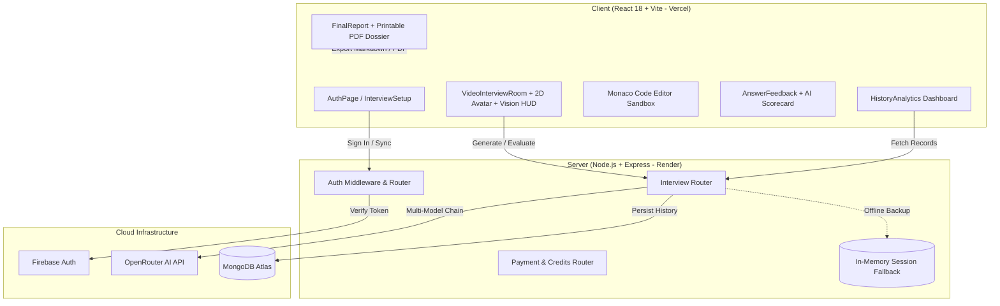

# InterviewAI 🚀
*Production-Grade MERN Stack AI Mock Interview Platform*

[](https://interview-ai-nu-one.vercel.app/)
[](https://interview-ai-y18k.onrender.com/)
[-6366f1)](#-tech-stack)
[-06b6d4)](#-ai-interviewer--evaluation-engine)
[](#-computer-vision-telemetry)
[](#-authentication--security)
[](#-license)

---

### 🌐 Live Deployments & URLs
- 🚀 **Live Frontend Application**: [https://interview-ai-nu-one.vercel.app/](https://interview-ai-nu-one.vercel.app/)
- ⚙️ **Live Backend API**: [https://interview-ai-y18k.onrender.com/](https://interview-ai-y18k.onrender.com/)
- 🩺 **API Health Check**: [https://interview-ai-y18k.onrender.com/api/health](https://interview-ai-y18k.onrender.com/api/health)
- 📦 **GitHub Repository**: [https://github.com/Siddharth-Saurabh/interview-AI](https://github.com/Siddharth-Saurabh/interview-AI)

---

**InterviewAI** is an intelligent, full-stack tech hiring simulator designed to help engineers practice, benchmark, and master live coding, technical screening, system design architecture, and behavioral bar raiser rounds.

> 📖 **Complete Platform Documentation**: For an in-depth, technical manual covering the full system architecture, API specifications, and component structure, refer to [DOCUMENTATION.md](./DOCUMENTATION.md) and [ARCHITECTURE_AND_STUDY_GUIDE.md](./ARCHITECTURE_AND_STUDY_GUIDE.md).

---

## 🌟 Key Features & Platform Highlights

### 🎙️ 1. AI Video Call Studio & 2D Animated Talking Avatars
- **2D Lip-Sync Animated Character**: SVG vector avatar with dynamic mouth movements synced to AI question speech narration, natural eye blinks, and responsive emotional expressions.
- **4 Selectable Interviewer Personas**:
  - 👨‍💻 **Alex Rivera** (*Lead Architect*) — Technical deep-dives & distributed systems.
  - 👩‍💼 **Sarah Chen** (*VP of Engineering*) — Strategic architecture & high-level decision making.
  - 👨‍🔬 **David Miller** (*Senior Staff SDE*) — Algorithms, concurrency & low-level performance.
  - 👩‍⚖️ **Elena Rostova** (*Director of Talent*) — STAR behavioral framework & culture fit.
- **Live Candidate Webcam Stream**: Real-time camera feed with video flipping/mirroring and on/off controls.
- **Conferencing Layout Modes**: Split Grid View, Spotlight View, and Split Code Studio with Monaco IDE.

---

### 👁️ 2. Real-Time Computer Vision & Body Language Telemetry
- **100% In-Browser Privacy**: Frame analysis executed locally via HTML5 Canvas with zero video recording or uploads.
- **Direct Eye Contact %**: Measures gaze vector against camera center and tracks attention distribution (*Center*, *Left*, *Right*, *Down*).
- **Posture Alignment & Centering**: Detects upright posture, frame centering, and slouching.
- **Facial Composure Score**: Real-time composure (1–10) and head stability jitter tracking.
- **Live Vision HUD Overlay**: Mini real-time coaching pill over the candidate video tile with actionable presence tips.

---

### 💻 3. Monaco Code Editor & Live Algorithmic Sandbox
- **Industry Standard IDE**: Powered by `@monaco-editor/react` (the VS Code core).
- **Multi-Language Support**: JavaScript (Node.js), TypeScript, Python 3, Java, C++.
- **Interactive Sandbox & Test Cases**: LeetCode-style test case execution with error boundary and output console.
- **AI Big-O Complexity Scoring**: Time Complexity ($O(N)$) and Space Complexity ($O(1)$) analysis with 10/10 optimal benchmark solutions.

---

### 🔊 4. Voice Synthesis (TTS) & Speech Recognition (STT)
- **Audio Voice Synthesis (TTS)**: Web Speech Synthesis dynamically modulates pitch and speech rate across personas.
- **Real-Time Speech-to-Text (STT)**: Microphone speech streaming directly into live editable transcripts.
- **Cadence & Verbal Filler Analytics**: Tracks filler words (`um`, `uh`, `like`, `basically`), speaking duration, and words-per-minute pace.
- **Audio Synthesizer FX**: Native Web Audio sound effects for mic toggles, success chimes, and milestone reviews.

---

### 🏆 5. 4-Stage Multi-Round Hiring Pipeline
- **Round 1: Live Coding & Algorithms** — In-browser Monaco IDE challenges with test cases and Big-O evaluation.
- **Round 2: Technical Screening** — Deep dive into language mechanics, async event loops, security, and internals.
- **Round 3: System Design & Architecture** — High concurrency, distributed databases, Redis caching, microservices, and sharding.
- **Round 4: Behavioral & Bar Raiser** — Executive STAR framework (Situation, Task, Action, Result) communication and leadership trade-offs.

---

### 📊 6. Performance Analytics & Printable PDF Dossier
- **Analytics Dashboard**: Tracks Total Sessions, Average Score (/10), Personal Best, and Clearance Pass Rate (%).
- **Multi-Dimensional Competencies**: Detailed ratings for Technical Knowledge, Code Quality, Communication, Problem Solving, Clarity, and Confidence.
- **Printable PDF Export**: Generate branded dossiers and printable reports (`window.print()`).
- **10/10 Model Answers**: Displays benchmark architectural responses for every question.

---

### 💳 7. Credits System & Payments Integration
- Built-in credits system (10 credits per mock interview round).
- Razorpay payment modal with live checkout and offline local testing fallback simulation.

---

## 🏛️ System Architecture



---

## 🛠️ Tech Stack

### Frontend
- **Deployment**: Vercel
- **Framework**: React 18 (Vite build system)
- **Code Studio**: `@monaco-editor/react` (VS Code Editor)
- **Computer Vision**: HTML5 Canvas In-Browser Pixel & Gaze Tracking
- **Avatars**: Vector SVG Lip-Sync Animation System
- **UI & Icons**: Lucide React, Glassmorphism design system
- **Effects**: Canvas Confetti, Web Audio API Sound Synthesizer
- **Voice APIs**: Web Speech Synthesis API, Web Speech Recognition API
- **Auth SDK**: Firebase Authentication SDK

### Backend
- **Deployment**: Render Cloud
- **Runtime & Framework**: Node.js, Express 5
- **Database & ORM**: MongoDB Atlas, Mongoose ODM
- **AI Integration**: OpenRouter Multi-Model Gateway (`deepseek-chat`, `gemini-2.0-flash`, `llama-3.3-70b`, `qwen-2.5-72b`)
- **Payments**: Razorpay Node SDK & Crypto verification
- **Authentication**: JWT (JSON Web Tokens), Cookie-Parser

---

## 🚀 Quick Start Guide

### 1. Prerequisites
- **Node.js**: `v18.0.0` or higher
- **npm**: `v9.0.0` or higher

### 2. Environment Configuration

Create `.env` in the `server/` directory:
```env
PORT=8000
MONGO_URL=mongodb+srv://<username>:<password>@cluster.mongodb.net/interviewai
OPENROUTER_API_KEY=your_openrouter_api_key
RAZORPAY_KEY_ID=your_razorpay_key_id
RAZORPAY_KEY_SECRET=your_razorpay_key_secret
JWT_SECRET=your_super_secret_jwt_key
```

Create `.env` in the `client/` directory:
```env
VITE_API_URL=https://interview-ai-y18k.onrender.com
VITE_FIREBASE_API_KEY=your_firebase_api_key
VITE_FIREBASE_AUTH_DOMAIN=your_project.firebaseapp.com
VITE_FIREBASE_PROJECT_ID=your_project_id
VITE_FIREBASE_STORAGE_BUCKET=your_project.firebasestorage.app
VITE_FIREBASE_MESSAGING_SENDER_ID=your_sender_id
VITE_FIREBASE_APP_ID=your_app_id
VITE_FIREBASE_MEASUREMENT_ID=your_measurement_id
VITE_RAZORPAY_KEY_ID=your_razorpay_key_id
```

### 3. Installation & Running Locally

#### Start Backend API Server
```bash
cd server
npm install
npm run dev
# Server running on http://localhost:8000
```

#### Start Frontend Client Server
```bash
cd client
npm install
npm run dev
# Client running on http://localhost:5173
```

---

## 📡 REST API Specification

| Method | Endpoint | Description | Auth Required |
| :--- | :--- | :--- | :--- |
| `POST` | `/api/auth/sync` | Sync user with Firebase / Register email | ❌ No |
| `GET` | `/api/auth/profile` | Retrieve active user profile & AI credit balance | 🔒 Bearer JWT |
| `POST` | `/api/interview/generate` | Synthesize AI interview questions | 🔒 Bearer JWT |
| `POST` | `/api/interview/evaluate` | Evaluate candidate response in real-time | 🔒 Bearer JWT |
| `GET` | `/api/interview/history` | Retrieve user performance history & analytics | 🔒 Bearer JWT |
| `DELETE`| `/api/interview/:id` | Delete session record from history | 🔒 Bearer JWT |
| `GET` | `/api/payment/plans` | Fetch credit top-up packages | ❌ No |
| `POST` | `/api/payment/create-order`| Create Razorpay payment order | 🔒 Bearer JWT |
| `POST` | `/api/payment/verify-payment`| Verify payment signature & add credits | 🔒 Bearer JWT |

---

## 👤 Demo Account Credentials

For instant platform access:
- **Email**: `demo@interviewai.dev`
- **Password**: `Password123!`

---

## 👨‍💻 Author & Developer

**Siddharth Saurabh**
* 🎓 Chandigarh University • 2nd Year Student
* 💻 B.E. in Computer Science & Engineering (CSE)
* 🐙 GitHub: [@Siddharth-Saurabh](https://github.com/Siddharth-Saurabh)

---

## 📄 License
This project is licensed under the **MIT License** - see the [LICENSE](./LICENSE) file for full details.  
Copyright © 2026 Siddharth Saurabh. All Rights Reserved.
